# Cloud Inventory System

A Spring Boot inventory and order-management REST API, containerised with Docker and deployed to
**Azure Kubernetes Service** through a GitOps pipeline: **Azure Pipelines** builds and tests every commit,
pushes the image to **Azure Container Registry**, and **ArgoCD** + **ArgoCD Image Updater** roll the new
build out to the cluster automatically.


---

## Contents

- [Architecture](#architecture)
- [CI/CD pipeline](#cicd-pipeline)
- [Tech stack](#tech-stack)
- [Repository layout](#repository-layout)
- [API](#api)
- [Data model](#data-model)
- [Running locally](#running-locally)
- [Deploying to Azure](#deploying-to-azure)
- [Screenshots](#screenshots)

---

## Architecture

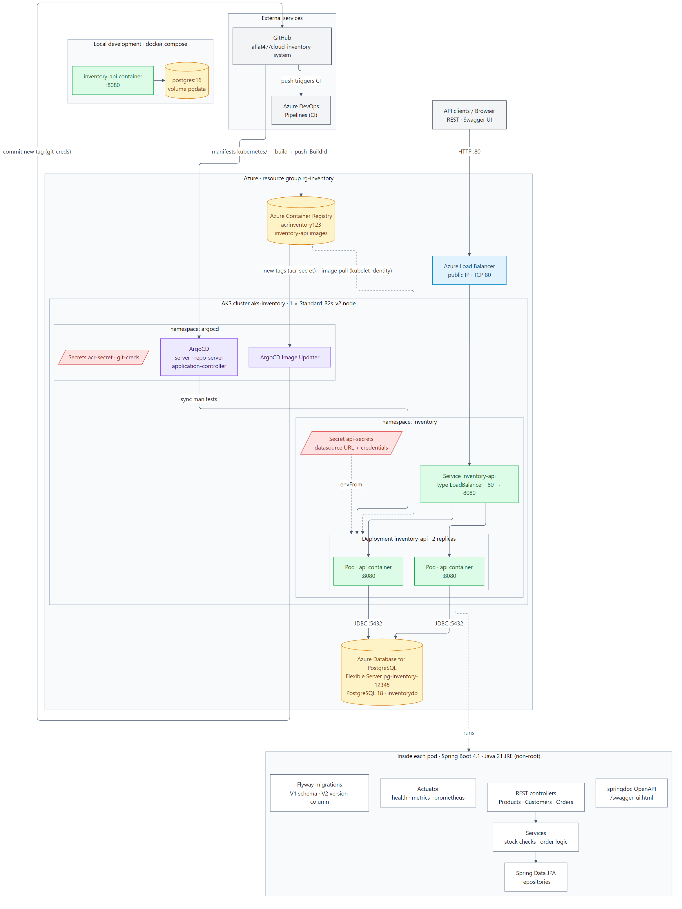

| Layer | Component |
|---|---|
| Entry point | Azure Load Balancer (public IP, TCP 80) created by the `LoadBalancer` Service |
| Compute | AKS cluster `aks-inventory`, namespace `inventory`, Deployment `inventory-api` with 2 replicas |
| Database | Azure Database for PostgreSQL Flexible Server `pg-inventory-12345` (PostgreSQL 18) |
| Registry | Azure Container Registry `acrinventory123` |
| GitOps | ArgoCD + ArgoCD Image Updater in namespace `argocd` |
| Configuration | Datasource settings injected from the `api-secrets` Secret via `envFrom` |
| Health | Startup, readiness and liveness probes on Spring Boot Actuator |

---

## CI/CD pipeline

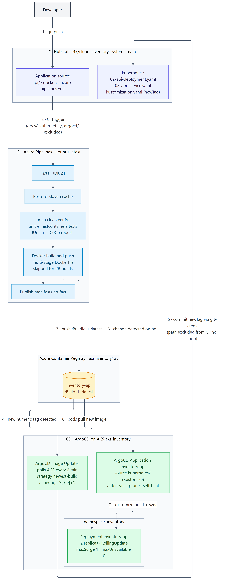

1. **Push to `main`** triggers [azure-pipelines.yml](azure-pipelines.yml). Changes to `docs/`, `screenshots/`,
   `kubernetes/`, `argocd/` and `README.md` do not trigger a build.
2. **CI** installs JDK 21, restores the Maven cache and runs `mvn clean verify` — unit tests, `@WebMvcTest`
   slice tests and Testcontainers integration tests against a real PostgreSQL. JUnit and JaCoCo reports are
   published to the run.
3. **Docker build & push** — the multi-stage [Dockerfile](docker/Dockerfile) image is pushed to ACR as
   `inventory-api:<BuildId>` and `inventory-api:latest`. Pull-request builds run the tests but never push.
4. **ArgoCD Image Updater** ([argocd/image-updater.yaml](argocd/image-updater.yaml)) polls ACR every 2 minutes and
   picks the newest numeric tag (`^[0-9]+$`, so `latest` is ignored).
5. It **commits the new tag** to [kubernetes/kustomization.yaml](kubernetes/kustomization.yaml) on `main`. That path
   is excluded from the CI trigger, so the write-back does not cause a rebuild loop.
6. **ArgoCD** ([argocd/application.yml](argocd/application.yml)) detects the commit and syncs the Kustomize app with
   automated prune and self-heal.
7. Kubernetes performs a **zero-downtime rolling update** (`maxSurge: 1`, `maxUnavailable: 0`).

Every deployed version is therefore a git commit: `git log kubernetes/kustomization.yaml` is the deployment
history, and reverting a commit rolls back.

---

## Tech stack

| Area | Technology |
|---|---|
| Language / runtime | Java 21, Eclipse Temurin JRE, runs as a non-root user |
| Framework | Spring Boot 4.1 — Web MVC, Data JPA, Validation, Actuator |
| Database | PostgreSQL, schema managed by Flyway |
| API docs | springdoc-openapi (Swagger UI) |
| Tests | JUnit 5, Mockito, `@WebMvcTest`, Testcontainers (PostgreSQL) |
| Build | Maven, multi-stage Docker build |
| CI | Azure Pipelines |
| Registry | Azure Container Registry |
| Orchestration | Azure Kubernetes Service, Kustomize |
| CD | ArgoCD, ArgoCD Image Updater |

---

## Repository layout

```
.
├── api/                      Spring Boot application (Maven)
│   └── src/main/resources/
│       ├── application.yml
│       └── db/migration/     Flyway migrations (V1 schema, V2 optimistic-lock version)
├── docker/
│   ├── Dockerfile            multi-stage build → eclipse-temurin:21-jre
│   └── docker-compose.yml    API + PostgreSQL 16 for local development
├── kubernetes/               manifests synced by ArgoCD
│   ├── 02-api-deployment.yaml
│   ├── 03-api-service.yaml
│   └── kustomization.yaml    image tag — updated by Image Updater
├── argocd/
│   ├── application.yml       ArgoCD Application
│   └── image-updater.yaml    ImageUpdater CR (tag policy + git write-back)
├── azure-pipelines.yml       CI pipeline
├── docs/                     deployment guide and diagrams
└── screenshots/
```

---

## API

Interactive documentation is served at **`/swagger-ui.html`**.

### Endpoints

| Method | Path | Description |
|---|---|---|
| `GET` | `/api/products` | List products (paged, filterable) |
| `GET` | `/api/products/{id}` | Get a product |
| `POST` | `/api/products` | Create a product |
| `PUT` | `/api/products/{id}` | Update a product |
| `DELETE` | `/api/products/{id}` | Delete a product |
| `POST` | `/api/customers` | Create a customer |
| `GET` | `/api/customers/{id}` | Get a customer |
| `POST` | `/api/orders` | Place an order |
| `GET` | `/api/orders/{id}` | Get an order with its lines |
| `POST` | `/api/orders/{id}/cancel` | Cancel a `PENDING` order and return its stock |

**Product filters:** `name`, `maxPrice`, `inStockOnly=true`, plus `page`, `size` (default 20, max 100) and
`sort` (default `createdAt,desc`).

### Example

```sh
# create a customer and a product
curl -X POST localhost:8080/api/customers -H 'Content-Type: application/json' \
     -d '{"email":"ada@example.com","fullName":"Ada Lovelace"}'

curl -X POST localhost:8080/api/products -H 'Content-Type: application/json' \
     -d '{"name":"Keyboard","description":"Mechanical","price":49.99,"quantity":10}'

# place an order
curl -X POST localhost:8080/api/orders -H 'Content-Type: application/json' \
     -d '{"customerId":1,"lines":[{"productId":1,"quantity":2}]}'
```

### Business rules

- Placing an order is a single transaction: stock is checked and decremented for every line, or nothing changes.
- Duplicate lines for the same product are merged; all products are loaded in one query.
- Each order line stores the **unit price at purchase time**, so later price changes don't alter past orders.
- Products use **optimistic locking** (`@Version`) to prevent lost updates under concurrent orders.
- Only `PENDING` orders can be cancelled; cancelling returns the stock. Statuses: `PENDING`, `PAID`, `SHIPPED`, `CANCELLED`.

### Errors

| Status | When |
|---|---|
| `400 Bad Request` | Validation failure (e.g. empty order, quantity outside 1–1000, invalid email) |
| `404 Not Found` | Unknown product, customer or order |
| `409 Conflict` | Insufficient stock, or a concurrent update (optimistic lock) |

### Operations

| Endpoint | Purpose |
|---|---|
| `/actuator/health` | Overall health (`/liveness` and `/readiness` groups are used by Kubernetes probes) |
| `/actuator/metrics` | Micrometer metrics |
| `/actuator/prometheus` | Prometheus scrape endpoint |

---

## Data model

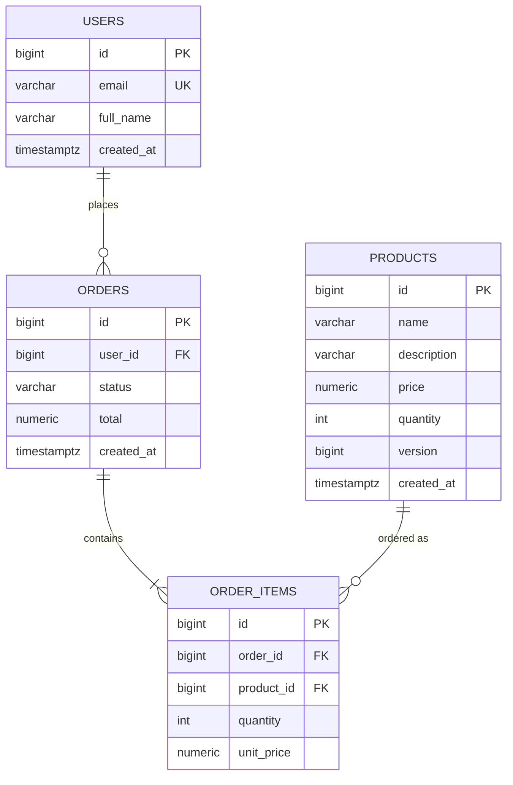

Hibernate runs with `ddl-auto: validate`; the schema is owned entirely by Flyway.

---

## Running locally

**Prerequisites:** Docker. JDK 21 is only needed to run Maven outside Docker.

```sh
cd docker
docker compose up --build
```

- API: http://localhost:8080 · Swagger UI: http://localhost:8080/swagger-ui.html
- PostgreSQL 16 on `localhost:5432` (database `inventorydb`, user `inventory`, data in the `pgdata` volume)
- The database password comes from `POSTGRES_PASSWORD` in `docker/.env` (default `inventorypass`)

**Tests** (Docker must be running — the integration tests start PostgreSQL with Testcontainers):

```sh
cd api
./mvnw clean verify
```

---

## Deploying to Azure

A full walkthrough is in [docs/Deploying-Inventory-API-to-Azure.docx](docs/Deploying-Inventory-API-to-Azure.docx).
In short:

1. **Provision** a resource group, ACR, an AKS cluster attached to the ACR, and a PostgreSQL Flexible Server.
2. **Create the app secret** in the `inventory` namespace:
   ```sh
   kubectl create namespace inventory
   kubectl -n inventory create secret generic api-secrets \
     --from-literal=SPRING_DATASOURCE_URL='jdbc:postgresql://<server>.postgres.database.azure.com:5432/inventorydb?sslmode=require' \
     --from-literal=SPRING_DATASOURCE_USERNAME='<user>' \
     --from-literal=SPRING_DATASOURCE_PASSWORD='<password>'
   ```
3. **Install ArgoCD and ArgoCD Image Updater** in the `argocd` namespace, then give Image Updater access to ACR
   (`acr-secret`, referenced from `registries.conf`) and to GitHub (`git-creds`, a token with *Contents: read and write*):
   ```sh
   kubectl -n argocd create secret generic git-creds \
     --from-literal=username=<github-user> --from-literal=password=<token>
   ```
4. **Register the app:**
   ```sh
   kubectl apply -f argocd/
   ```
5. **Create the Azure Pipelines pipeline** from `azure-pipelines.yml` with a Docker registry service connection
   named `acr-docker`.

From then on, every merge to `main` is built, tested and deployed automatically.

---

## Screenshots

### Azure infrastructure

| Resource group | Container registry |
|---|---|
| 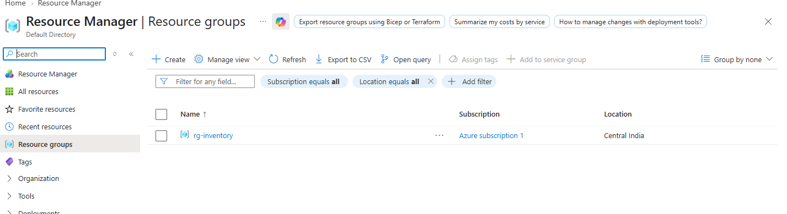 | 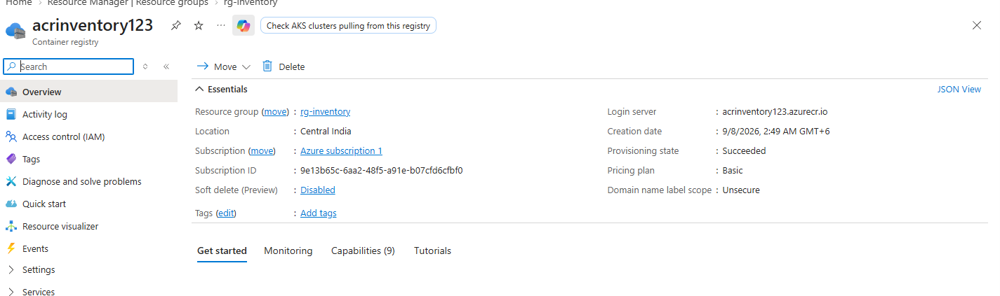 |

| Image pushed to ACR | AKS cluster running |
|---|---|
| 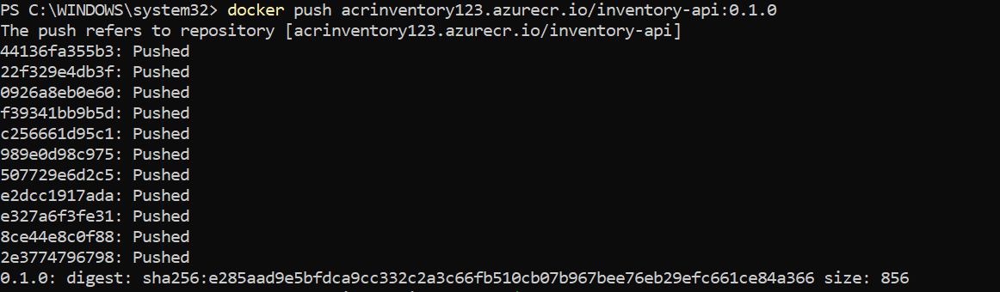 | 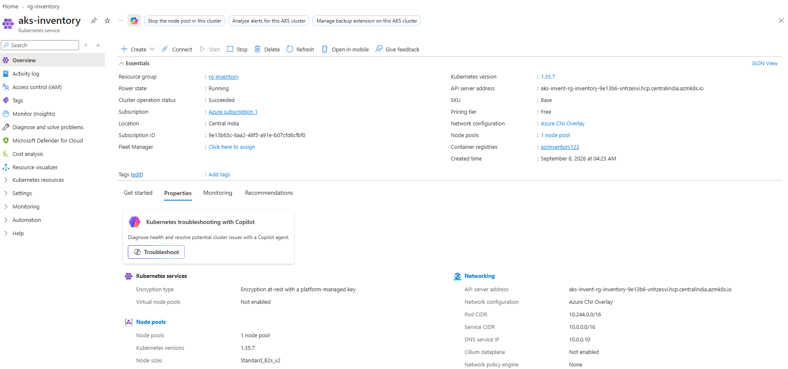 |

### Kubernetes deployment

| kubectl context | Pods running |
|---|---|
| 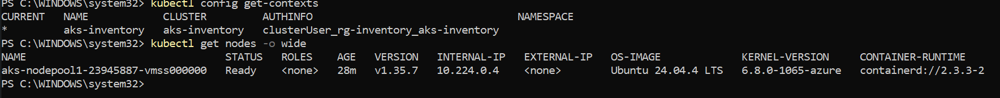 | 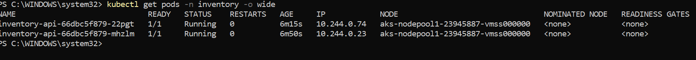 |

| Service external IP | Swagger UI live |
|---|---|
| 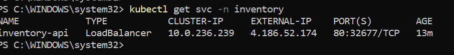 | 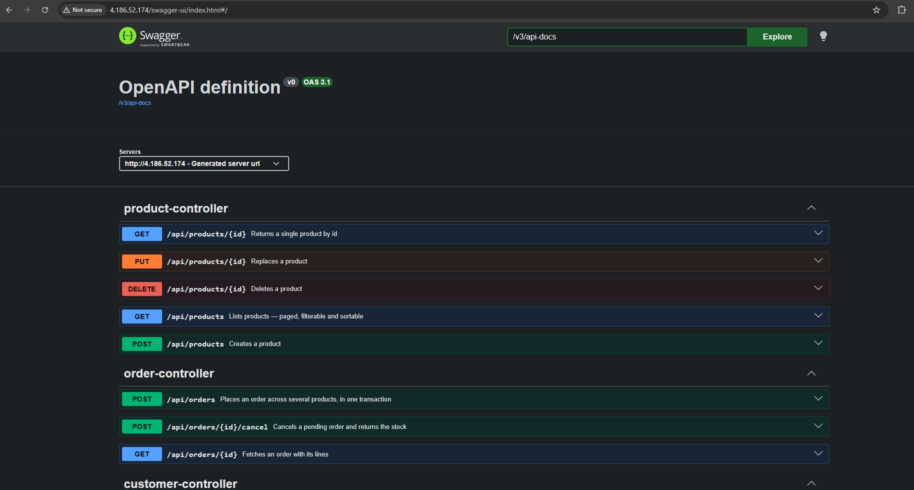 |

**Rolling update**

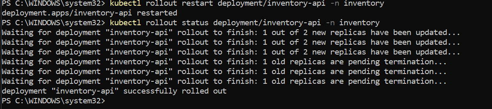

### Continuous delivery with ArgoCD

The same build traced end to end, from the old image to the new one.

| Before: pods on the previous build | New numeric tag in ACR |
|---|---|
| 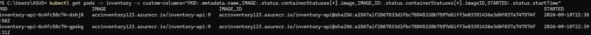 | 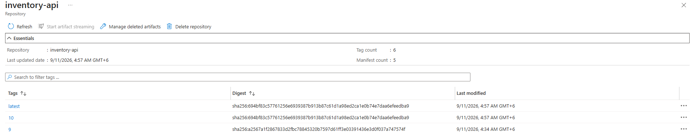 |

| Image Updater commits the new tag | ArgoCD synced to that commit |
|---|---|
| 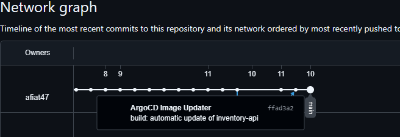 | 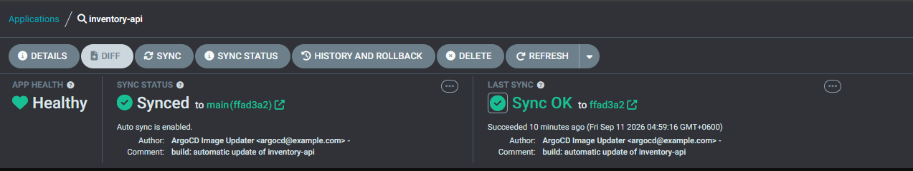 |

| ArgoCD rollout | After: pods on the new build |
|---|---|
| 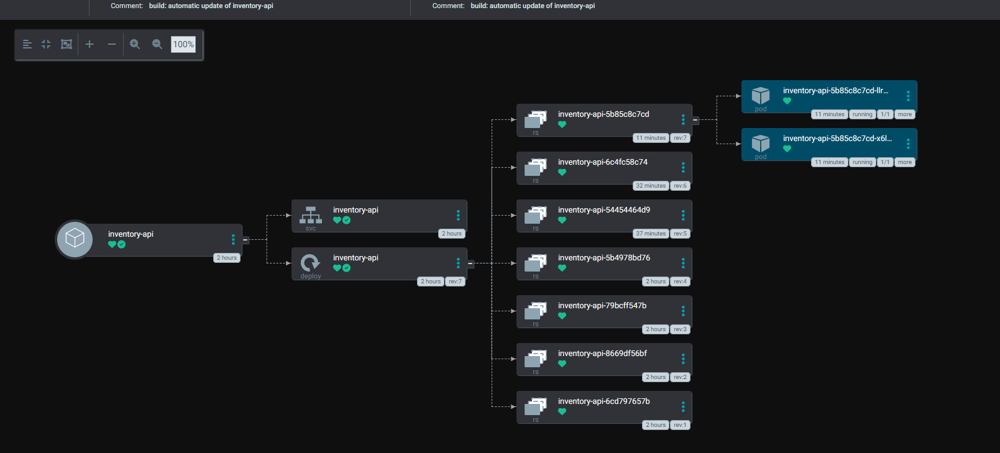 | 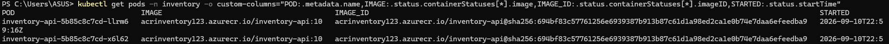 |
